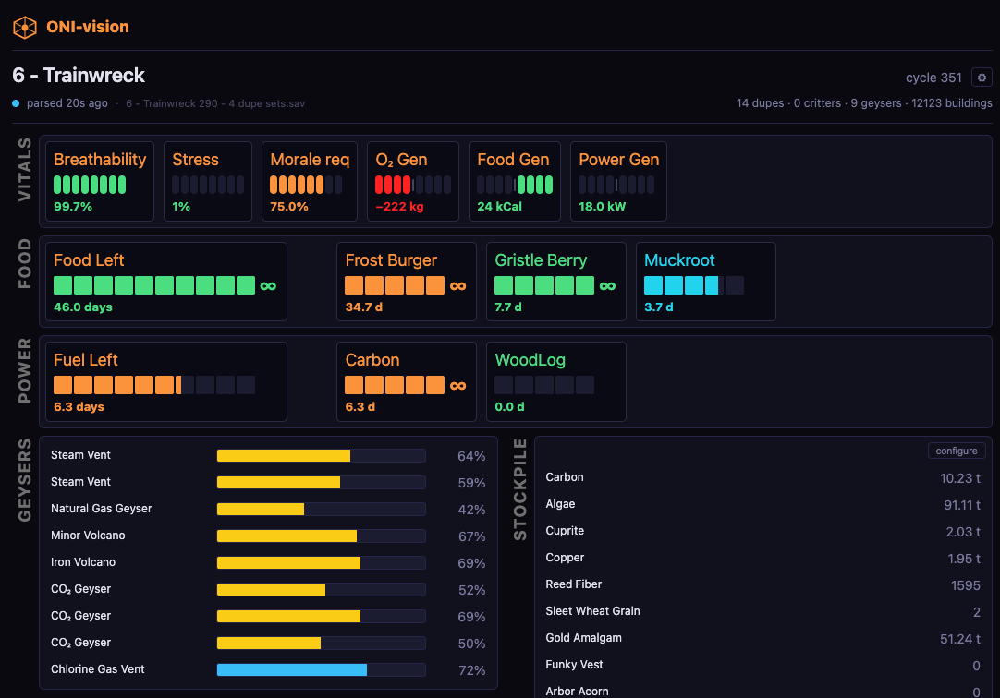

# oni-vision



A small Node.js daemon that watches your **Oxygen Not Included** save folder, parses the latest `.sav` file, and writes a SQLite database (plus a JSON sidecar) that Claude — or any tool that speaks SQL — can query token-efficiently.

A 4 MB ONI save expands to 30–80 MB of JSON. Reading that into Claude's context is wasteful; a focused SQL query against the same data is ~200 tokens. That's what this tool exists to do.

## Acknowledgment

Save-file decoding is done by [`oni-save-parser`](https://github.com/RoboPhred/oni-save-parser) by RoboPhred — `oni-vision` is a watcher + extractor + SQLite writer sitting on top of it. None of the binary-format reverse engineering is mine. If parsing breaks on a brand-new ONI patch, the fix usually lives there first.

## Features

- **Zero-config startup.** Probes per-platform well-known locations for `cloud_save_files` / `save_files` and picks the most-recent `.sav`. No setup file required for typical Steam-on-Mac/Windows/Linux installs.
- **Atomic refresh.** Every save event reparses and atomically renames `current.sqlite`, `current.json`, and `current.sav` into place — readers never see a half-written file.
- **One DB schema, indexed for the common questions.** Typed tables for duplicants (plus traits/skills/attributes/effects), buildings, world objects, storage contents, geysers, critters; plus a generic-fallback `behaviors` table with stringified JSON for anything we haven't lifted.
- **Cross-platform.** macOS (recent Steam + older Klei layouts), Windows, Linux.
- **Human-readable status.** `npm run status` prints a one-screen snapshot (cycle, dupe stress bars, geyser breakdown, top stored elements). The daemon prints the same block after every save. An in-process web dashboard at `http://localhost:8080` renders the same data live — on by default, disable with `"web": { "enabled": false }` in your config.
- **Claude Code / Cowork plugin.** [`oni-vision-plugin/`](./oni-vision-plugin) ships an MCP server with typed read-only tools (`oni_status`, `oni_dupe`, `oni_dupes`, `oni_geysers`, `oni_resources`, `oni_food`, `oni_save_meta`, `oni_freshness`, `oni_schema`, `oni_query`) plus two skills: `oni-vision` (data access) and `oni-architect` (ONI strategy / design advice grounded in your actual save). Responses default to compact JSON; tabular tools support `format: "tsv"` for further token savings.
- **No native compilation.** Uses Node 22.5+'s built-in `node:sqlite` module — no `better-sqlite3`, no rebuild on `nvm install`.
- **Tested.** 275 tests across the main project and plugin, run on Node 22.x and 24.x in CI.
- **MIT licensed.**

## Requirements

- Node.js **22.5 or newer** (for built-in `node:sqlite`).
- macOS, Linux, or Windows.

## Architecture

```
ONI .sav file
  → src/parser.js          (wraps oni-save-parser library)
  → src/extractors.js      (walks parsed save, emits per-table row arrays)
  → src/pipeline.js        (orchestrates, writes atomically)
  → current.sqlite         (single artifact every consumer reads)
                ├─→ src/ui.js           (CLI banner, npm run status)
                ├─→ src/web.js          (web dashboard, /api/status)
                └─→ oni-vision-plugin/  (MCP server for Claude Code)
```

Bullets:

- **Two-process model.** One writer (the daemon), N readers. Readers open the DB read-only; the daemon is the only thing that mutates `~/.oni-vision/output/`.

- **Atomic writes.** `current.sqlite`, `current.json`, and `current.sav` are each written to `.tmp` and `rename(2)`-ed into place. Readers never see a torn file.

- **Knowledge-module pattern.** Static game data — element names, geyser types, food metadata, effect labels, skill labels, chore groups, diseases — lives in `src/*.js` files (one per domain) and is projected into a SQLite lookup table on every parse. Every consumer JOINs against the table; nobody re-derives the data.

- **Typed tables for per-save data.** `duplicants`, `duplicant_traits` / `_skills` / `_attributes` / `_effects` / `_priorities`, `buildings`, `world_objects`, `storage_contents`, `geysers`, `critters`. Plus a generic `behaviors` table (JSON-stringified `template_data`) as the fallback for anything not yet lifted.

- **Three consumers, same DB.** The CLI banner (`src/ui.js`), the web dashboard (`src/web.js` + `src/web/`), and the MCP plugin (`oni-vision-plugin/`) all read from `current.sqlite` via SQL. The MCP plugin is self-contained (it has its own `lib/queries.js`) so it can be installed independently of the parent repo.

- **Single source of truth for game rules.** Numeric thresholds (stress-bad cutoff, geyser-quality cutoff, morale-bar max, etc.) live in `src/thresholds.js`, served via `/api/status` so the frontend never hardcodes them. Skill morale-cost rule lives in `src/skills.js`, computed once at parse time and stored on `duplicants.morale_cost`.

- **Lookup tables (always JOIN against these):** `elements`, `geyser_types`, `foods`, `effects`, `skills`, `chore_groups`, `diseases`.

For a deeper dive (schema, all consumers, design rationale) see [`docs/data-model.md`](docs/data-model.md).

## Build

```bash
git clone git@github.com:arielbloch/oni-vision.git
cd oni-vision
npm install
```

There's no compile step — the project is plain JavaScript ESM.

## Use

**Run as a daemon.** Reparses every time the game saves:

```bash
npm start
```

You'll see something like:

```
[vision] auto-detected save dir: /Users/you/Library/Application Support/unity.Klei.Oxygen Not Included/abc123/save_files
[vision]   newest save: my_colony.sav (2026-05-09T17:32:11.000Z)
[pipeline] parsed in 480 ms (cycle 312, dupes 12)
[pipeline]   extracted 184302 rows across 14 tables
[pipeline]   wrote outputs to ~/.oni-vision/output in 410 ms

═══ Cosmic Conundrum · cycle 312 ════════════════════════════════════════
12 duplicants · 4 critters · 7 geysers · 184 buildings
Parsed 0s ago from my_colony.sav
…
```

**Install as a login-time service (optional).** Registers the daemon to start automatically when you log in (LaunchAgent on macOS, systemd on Linux, Task Scheduler on Windows):

```bash
npm run setup
npm run uninstall   # to remove it
```

**One-shot parse.** No daemon, just reparse the latest save once:

```bash
npm run parse                         # newest .sav under saveDir
node src/parse-once.js path/to.sav    # a specific file
```

**Print the colony status.** Reads the already-parsed SQLite — does not reparse:

```bash
npm run status
```

**Web dashboard.** The daemon also serves a browser dashboard at `http://localhost:8080` — on by default, no auth, localhost-only. Single-page view of the same status block, polled every 5 seconds. Disable via config: `"web": { "enabled": false }`.

**Query from the shell.** Output lives at `~/.oni-vision/output/`:

```bash
sqlite3 ~/.oni-vision/output/current.sqlite \
  "SELECT name, ROUND(stress,1) AS stress, current_role FROM duplicants ORDER BY stress DESC"
```

**Query from Claude.** Two integration paths:

- **Lightweight.** Drop the contents of [`CLAUDE.md`](./CLAUDE.md) into your project's `CLAUDE.md`. Claude then writes raw `sqlite3` queries against the DB, using the lookup-table JOIN examples to get human-readable names.

- **Full-fat (recommended).** Install the [`oni-vision-plugin/`](./oni-vision-plugin) into Claude Code. Typed read-only tools + skills, no raw SQL needed for common questions. See [`oni-vision-plugin/README.md`](./oni-vision-plugin/README.md) for full details. Quick start:

  ```bash
  # Option A — Claude Code plugin system
  /plugin install /path/to/oni-vision/oni-vision-plugin

  # Option B — register only the MCP server (no plugin system required)
  claude mcp add oni-vision -- node --no-warnings=ExperimentalWarning \
    /path/to/oni-vision/oni-vision-plugin/mcp/server.js
  ```

  Verify the plugin loaded: ask Claude "what tools do you have for oni-vision?" — it should list `oni_status`, `oni_dupes`, `oni_query`, etc. If tools are missing, run `claude mcp list` to check the server is registered.

## Configuration

Most users don't need any. If you do — to override the save folder or the output location — drop a JSON config file at one of:

- `~/.oni-vision/config.json` (preferred), or
- `~/.config/oni-vision/config.json`

Copy and edit the pre-configured sample at [`.config-example.json`](./.config-example.json):

```bash
mkdir -p ~/.oni-vision
cp .config-example.json ~/.oni-vision/config.json
$EDITOR ~/.oni-vision/config.json   # replace <USERNAME> etc.
```

Keys: `saveDir` (string), `outputDir` (string, default `~/.oni-vision/output`), `includeAutoSaves` (boolean, default `true`), `debounceMs` (number, default `1500`). All are optional; missing keys fall back to platform defaults. There is no env-var override — config file is the only knob.

## Output

```
~/.oni-vision/output/
├── current.sqlite     # query this
├── current.json       # header / settings / non-tabular bits
└── current.sav        # copy of the parsed source save
```

For a full schema description (tables, indexes, convenience views) see [`CLAUDE.md`](./CLAUDE.md).

## Tests

```bash
npm test          # full suite: extractors, db, discovery, ui, utils, plugin queries
npm run smoke     # human-readable run against a synthetic fake save
```

CI runs `npm ci && npm test` on Node 22.x and 24.x for every push.

## Caveats

- Tile/element-by-cell map data is not exposed in tabular form — that's millions of cells. Use `current.json`'s world section, or the `buildings` / `world_objects` tables for material/temperature questions on placed objects.
- Geyser output is exposed as the *configuration rolls* (0–1 percentiles), not resolved kg/s rates. Resolving requires the library's geyser const-data; not lifted yet. See `oni-vision-plugin/skills/oni-architect/references/geysers.md` for the formula.
- DLC content (rockets, planetoids, clusters) is reachable through the generic `behaviors` table but doesn't yet have its own typed extractor.
- **Privacy note.** `current.json` and the `save_meta` table store the full absolute path of the parsed `.sav` file (typically something like `/Users/<name>/Library/…/my_colony.sav`). This is a localhost-only tool and the data never leaves your machine, but be aware if you share the output files. The web port (default 8080, or the next free port up to 8089) is bound to `127.0.0.1` by default.
- If parsing fails on a brand-new ONI patch, the fix typically lands in [`oni-save-parser`](https://github.com/RoboPhred/oni-save-parser) first; bump the dependency once it's released.

## License

MIT — see [`LICENSE`](./LICENSE). The bundled `oni-save-parser` dependency is also MIT-licensed.
